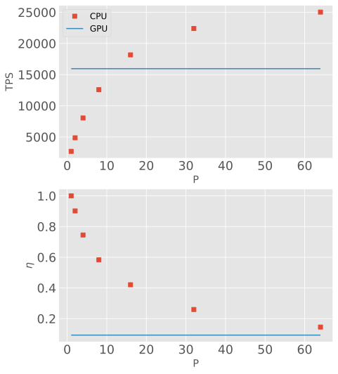
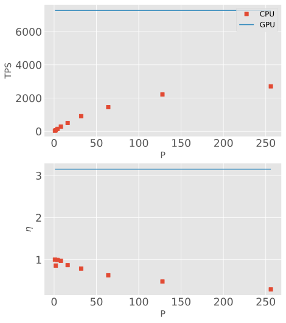

.. Copyright (c) 2009-2024 The Regents of the University of Michigan.
.. Part of HOOMD-blue, released under the BSD 3-Clause License.

How to determine the most efficient device
==========================================

Execute benchmarks of your simulation on a variety of device configurations then compare the results
to determine which is the most efficient. Your simulation model, parameters, system size, and
available hardware all impact the resulting performance. When benchmarking, make sure that all GPU
kernels have completed autotuning and that the memory caches have been warmed up before measuring
performance.

For example:

.. literalinclude:: determine-the-most-efficient-device.py
    :language: python

Example Results (N=2048)
------------------------

On AMD EPYC 7742 (PSC Bridges-2) and NVIDIA A100 (NCSA Delta), this script reports
(``$ mpirun -n $P python3 determine-the-most-efficient-device.py --device $PROCESSOR``):

.. list-table::
   :header-rows: 1

   * - Processor
     - P
     - TPS
   * - CPU
     - 1
     - 2699
   * - CPU
     - 2
     - 4868
   * - CPU
     - 4
     - 8043
   * - CPU
     - 8
     - 12585
   * - CPU
     - 16
     - 18168
   * - CPU
     - 32
     - 22394
   * - CPU
     - 64
     - 25031
   * - GPU
     - 1
     - 15955

The optimal device selection depends on the metric. When the metric is wall clock time only, choose
the highest performance benchmark. When the metric is a cost, choose based on the efficiency of each
device configuration.

One cost metric is compute time. Most HPC resources assign a cost by CPU core hours.
Some HPC resources may assign an effective cost to GPUs. When this is not the case, use the ratio of
available GPU hours to CPU core hours as a substitute. This example will assign a relative cost of
1 GPU hour to 64 CPU core hours. The efficiency is:

.. math::

    \eta =
    \begin{cases}
    \frac{S_\mathrm{P\ CPUs}}{S_\mathrm{1\ CPU}} \cdot \frac{1}{P} & \mathrm{CPU} \\
    \frac{S_\mathrm{P\ GPUs}}{S_\mathrm{1\ CPU}} \cdot \frac{1}{64 P} & \mathrm{GPU} \\
    \end{cases}

where :math:`S` is the relevant performance metric.

With 2048 particles in this example, the CPU is always more efficient than the GPU and the CPU is
faster than the GPU when :math:`P \ge 16`. Therefore, the CPU is always the optimal choice. Choose a
number of ranks :math:`P` depending on project needs and budgets. Larger values of :math:`P` will
provide results with lower latency at the cost of more CPU core hours. In this example, :math:`P=8`
(:math:`\eta \sim 0.6`) is a middle ground providing a significant reduction in time to solution at
a moderate extra cost in CPU core hours.

Example Results (N=131,072)
---------------------------

The results are very different with 131,072 particles
(``$ mpirun -n $P python3 determine-the-most-efficient-device.py --device $PROCESSOR --replicate=4``):

.. list-table::
   :header-rows: 1

   * - Processor
     - P
     - TPS
   * - CPU
     - 1
     - 36.072
   * - CPU
     - 2
     - 61.988
   * - CPU
     - 4
     - 143.25
   * - CPU
     - 8
     - 281.35
   * - CPU
     - 16
     - 502.48
   * - CPU
     - 32
     - 910.58
   * - CPU
     - 64
     - 1451.5
   * - CPU
     - 128
     - 2216.1
   * - CPU
     - 256
     - 2706.8
   * - GPU
     - 1
     - 7276.5

At a this system size, the GPU is always both faster and more efficient than the CPU.

Compare the two examples and notice that the TPS achieved by the GPU is only cut in half when the
system size is increased by a factor of 64. This signals that the smaller system size was not able
to utilize all the parallel processing units on the GPU.

.. note::

    Use trial moves per second (`hoomd.hpmc.integrate.HPMCIntegrator.mps`) as the performance
    metric when benchmarking HPMC simulations.
