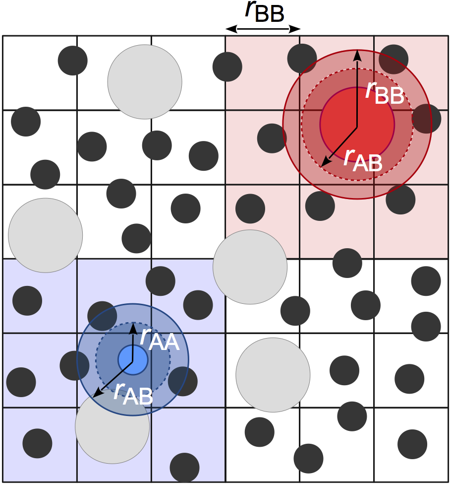
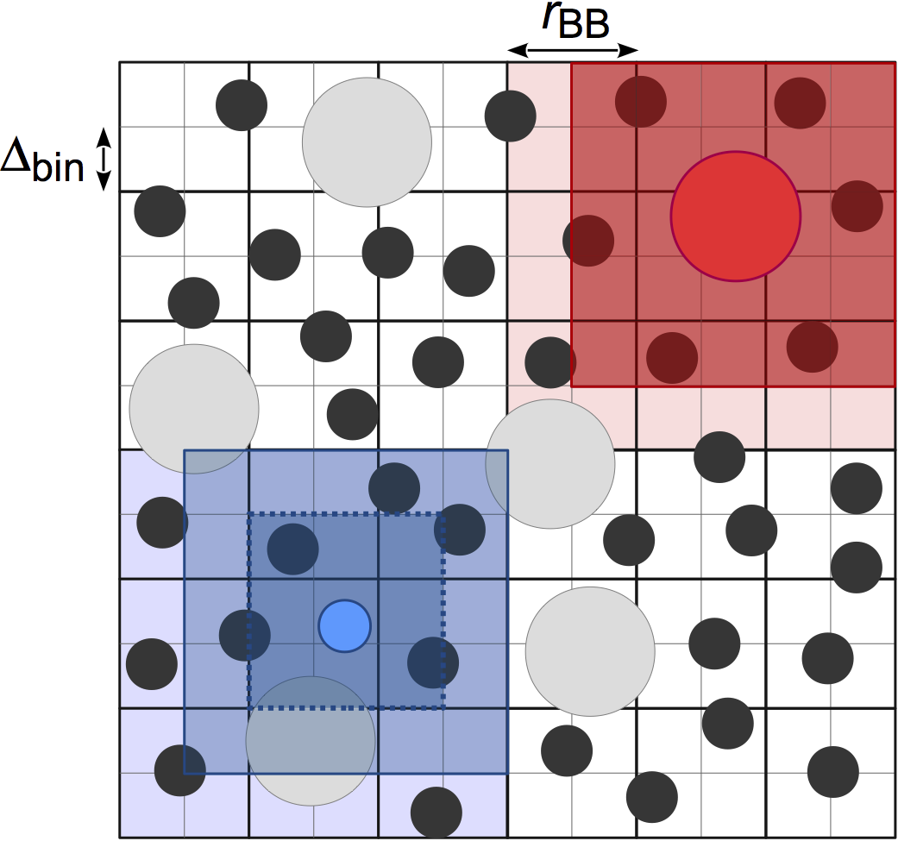
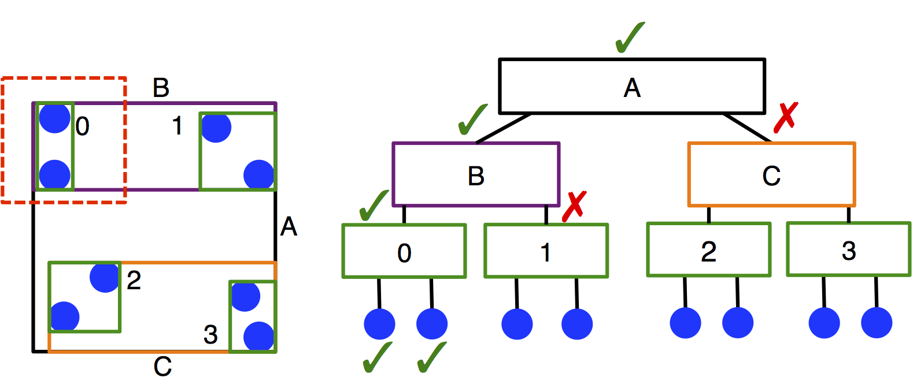

Neighbor lists
==============

Overview
--------

Neighbor lists accelerate the search for pairs of atoms that are within a certain *cutoff radius* of each other.
They are most commonly used in :py:class:`hoomd.md.pair` to accelerate the calculation of pair forces between
atoms. This significantly reduces the number of pairwise distances that are evaluated, which is
:math:`O(N^2)` if all possible pairs are checked. A small *buffer radius* (skin layer) ``r_buff`` is typically
added to the cutoff radius so that the neighbor list can be computed less frequently. The neighbor list must only be
rebuilt any time a particle diffuses ``r_buff/2``. However, increasing ``r_buff`` also increases
the number of particles that are included in the neighbor list, which slows down the pair force evaluation. A balance
can be obtained between the two by optimizing ``r_buff``.

A simple neighbor list is built by checking all possible pairs of atoms periodically, which makes the overall algorithm
:math:`O(N^2)`. The neighbor list can be computed more efficiently using an *acceleration structure* which further
reduces the complexity of the problem. There are three accelerators implemented in HOOMD-blue:

* :ref:`cell-list`

* :ref:`stenciled-cell-list`

* :ref:`lbvh-tree`

More details for each can be found below and in `M.P. Howard et al. 2016 <http://dx.doi.org/10.1016/j.cpc.2016.02.003>`_ and
`M.P. Howard et al. 2019 <https://doi.org/10.1016/j.commatsci.2019.04.004>`_ . Each neighbor list style has its own advantages
and disadvantages that the user should consider on a case-by-case basis.

.. _cell-list:

Cell list
---------

The cell-list neighbor list (:py:class:`hoomd.md.nlist.cell`) spatially sorts particles into bins that
are sized by the **largest** cutoff radius of all pair potentials attached to the neighbor list. For example, in the
figure below, there are small A particles and large B particles. The bin size is based on the cutoff radius of the
largest particles :math:`r_{\rm BB}`. To find neighbors, each particle searches the 27 cells that are adjacent to
its cell, which are shaded around each particle. Binning particles is *O(N)*, and so neighbor search from the cell
list is also *O(N)*.

This method is very efficient for systems with nearly monodisperse cutoffs, but performance degrades for large cutoff
radius asymmetries due to the significantly increased number of particles per cell and increased search volume. For
example, the small A particles, who have a majority of neighbors who are also A particles within cutoff :math:`r_{\rm AA}`
must now search through the full volume defined by :math:`r_{\rm BB}`. In practice, we have found that this neighbor
list style is the best option for most users when the asymmetry between the largest and smallest cutoff radius is
less than 2:1, but the performance of :py:class:`hoomd.md.nlist.tree` may still be competitive at smaller asymmetries.

.. note::
    Users may find that the cell-list neighbor list consumes a significant amount of memory, especially on CUDA devices.
    One cause of this can be non-uniform density distributions because the memory allocated for the cell list
    is proportional the maximum number of particles in any cell. Another common cause is large system volumes combined
    with small cutoffs, which results in a very large number of cells in the system. In these cases, consider using
    :py:class:`hoomd.md.nlist.stencil` or :py:class:`hoomd.md.nlist.tree`.

.. _stenciled-cell-list:

Stenciled cell list
-------------------

Performance of the simple cell-list can be improved in the size asymmetric case by basing the bin size of the cell
list on the **smallest** cutoff radius of all pair potentials attached to the neighbor list
(`P.J. in't Veld et al. 2008 <http://dx.doi.org/10.1016/j.cpc.2008.03.005>`_). From the previous example, the bin size is now based
on :math:`r_{\rm AA}`. A *stencil* is then constructed on a per-pair basis that defines the bins to search. Some particles
can now be excluded without distance check if they lie in bins outside the stencil. The small A particles only need
to distance check other A particles in the dark blue cells (dashed outline). This reduces both the number of distances
evaluations and the amount of particle data that is read.

We have found that the stenciled cell list (:py:class:`hoomd.md.nlist.stencil`) is most useful when a cell list
performs well, but is too memory intensive. It may also be useful for some systems with modest size asymmetry or many
types. The memory consumed by the stenciled cell list is typically much lower than that used
for a comparable simple cell list because of the way the stencils constructed to query the cell list. However, this
comes at the expense of higher register usage on CUDA devices, which may lead to reduced performance compared to the
simple cell list in some cases depending on your CUDA device's architecture.

.. note::
    Users may still find that the stenciled cell list consumes a significant amount of memory for systems with large
    volumes and small cutoffs. In this case, the bin size should be made larger (possibly at the expense of
    performance), or :py:class:`hoomd.md.nlist.tree` should be used instead.

.. _lbvh-tree:

LBVH tree
---------

Linear bounding volume hierarchies (LBVHs) are an entirely different approach to accelerating the neighbor search.
LBVHs are binary tree structures that partition the system based on *objects* rather than space (see schematic below).
This means that the memory they require scales with the number of particles in the system rather than the system volume,
which may be particularly advantageous for large, sparse systems. Because of their lightweight memory footprint,
LBVHs can also be constructed per-type, and this makes searching the trees very efficient in size asymmetric systems.
The LBVH algorithm is *O(N* log *N)* to search the tree.

We have found that LBVHs (:py:class:`hoomd.md.nlist.tree`) are very useful for systems with size asymmetry greater than 2:1 between the largest
and smallest cutoffs. These conditions are typical of many colloidal systems. Additionally, LBVHs can be used advantageously in sparse systems
or systems with large volumes, where they have less overhead and memory demands than cell lists. The performance of the
LBVHs has been improved since their original implementation (see `M.P. Howard et al. 2019 <https://doi.org/10.1016/j.commatsci.2019.04.004>`_
for details), making them more competitive for different types of systems.

Multiple neighbor lists
-----------------------

Multiple neighbor lists can be created to accelerate simulations where there is significant disparity in the pairwise
cutoffs between pair potentials. If one pair force has a maximum cutoff radius much smaller than
another pair force, the pair force calculation for the short cutoff will be slowed down considerably because many
particles in the neighbor list will have to be read and skipped because they lie outside the shorter cutoff. Attaching
each potential to a different neighbor list may improve performance of the pair force calculation at the expense of
duplicate computation of the neighbor list. When using multiple neighbor lists, it may be advantageous to adopt two
different neighbor list styles. For example, in a colloidal suspension of a small number of large colloids dispersed
in many solvent particles, a modest performance gain may be achieved by computing the solvent-solvent neighbors using
:py:class:`hoomd.md.nlist.cell`, but the solvent-colloid and colloid-colloid interactions using :py:class:`hoomd.md.nlist.tree`.
Particles can be excluded from neighbor lists by setting their cutoff radius to ``False`` or a negative value.
